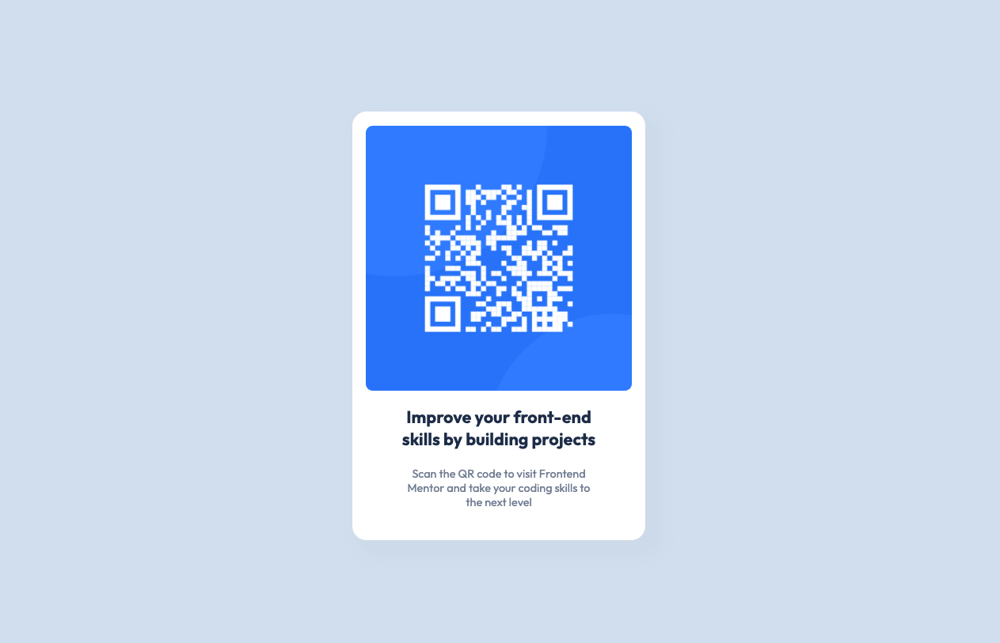

# Frontend Mentor - QR code component solution

### Screenshot

This is a solution to the [QR code component challenge on Frontend Mentor](https://www.frontendmentor.io/challenges/qr-code-component-iux_sIO_H). Frontend Mentor challenges help you improve your coding skills by building realistic projects. 

## Table of contents

- [Overview](#overview)
  - [Links](#links)
- [My process](#my-process)
  - [Built with](#built-with)
  - [What I learned](#what-i-learned)
  - [Continued development](#continued-development)
  - [Useful resources](#useful-resources)
- [Author](#author)
- [Acknowledgments](#acknowledgments)

**Note: Delete this note and update the table of contents based on what sections you keep.**

## Overview

### Links

- Solution URL: [Add solution URL here](https://your-solution-url.com)
- Live Site URL: [Add live site URL here](https://your-live-site-url.com)

## My process
Just like I always try to do, I started off with a HTML skeleton. 
This layout is super simple:)
- card-container 
  - card-top
    - QR code img
  - card-bottom
    - h1
    - p

Next, I created a scss file, "watched" it with the Live SASS Compiler extension VSCode and connected the resulting css file to my index.html file.

I created variable, mixin, and card scss files and started working on the layout CSS first. 

Then I added all my style CSS.

Then it was done. Not much to this one but good practice for sure!

### Built with

- Semantic HTML5 markup
- CSS custom properties
- Flexbox
- Mobile-first workflow
- [SASS](https://sass-lang.com/) - Sass

### What I learned
I got more comfortable setting up SASS in a project. However, I think this project is so simple it doesnt really NEED it, you know? lol. It's basically centering a few divs and rounding some corners. 

Anyway, I learned to remember to link the generated CSS file to the html file or the styles you add will generate.

This was also a great little practice project of building up a quick component. I was quickly able to get this looking like the figma file especially since there is no functionality and didnt even need JS.

UPDATE: I deployed this with github pages which I have not done in a LONG time so it was basically my first time again. lol. I learned how to deploy a lil simple project to github pages.

## Author

- Website - [Sevrinn Welker](https://sevrinn.dev/)
- Frontend Mentor - [@sevrinn](https://www.frontendmentor.io/profile/sevrinn)
- Twitter - [@sev_welker](https://www.twitter.com/sev_welker)

